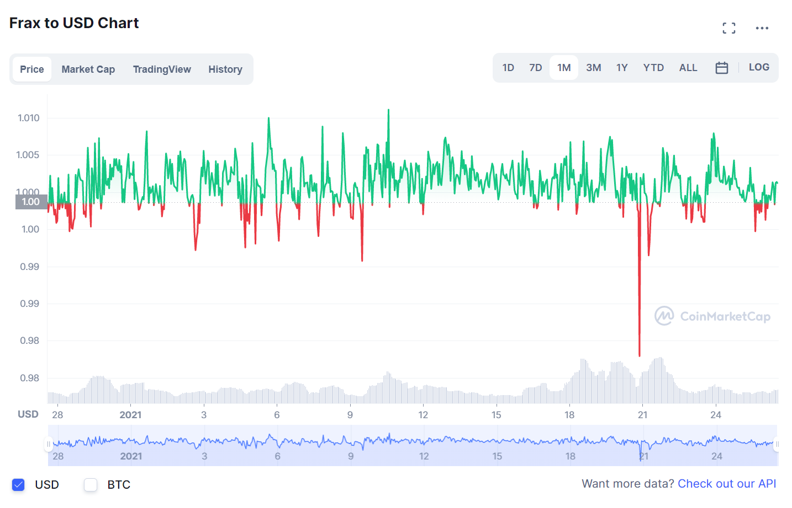

# AIP: Add FRAX as Collateral to Aave v2

ARC to https://governance.aave.com/t/add-frax-as-collateral-to-aave-v2/7122

## Simple Summary

FRAX is a stablecoin issued by Frax. It boasts being the first algorithmic stablecoin backed by on-chain collateral.

## Abstract

We propose to add FRAX as collateral to the Aave V2 market. Already used for lending on Aave, FRAX is an ideal candidate to be included on Aave as a collateral asset to provide more decentralized stablecoin alternatives.

The FRAX stablecoin is partially backed with on-chain collateral and partially backed algorithmically, according to a collateral ratio (CR) parameter that the system adjusts according to market conditions. In Frax v2, the protocol is able to mint FRAX into lending markets using Algorithmic Market Operations 2 (AMOs), smart contracts which have the ability to print FRAX up to certain thresholds adjustable by governance.

## Motivation

The presence of stablecoins on Aave is a key benefit for lenders of the protocol, providing lenders borrow liquidity for stablecoins against volatile assets lent to Aave. FRAX, a reliable and popular stablecoin in DeFi, would be an asset to Aave in this respect. FRAX also brings a high volume of liquidity and motivated users, which would in turn direct more liquidity to Aave.

Most importantly, FRAX is already heavily used by Aave. Users are already able to lend FRAX through Aave. This demonstrates that Aave has tested and approved of FRAX and its stability. A total of 11.9M of FRAX has been borrowed through Aave, and there is 26.6M in available liquidity. Given the success of FRAX on Aave, the next step is to enable FRAX as collateral.

FRAX has remained pegged to USD since its launch in 2020. The 30 day high and low are $1.03 and $0.9741 respectively. FRAX is partially backed with on-chain collateral and partially backed algorithmically, a somewhat different approach to soft-pegging than other stablecoins. FRAX has shown undeniable success in maintaining its peg at $1. FRAX is ranked number eleven out of all stablecoins on the market based on market capitalization.

FRAX is already listed on Decentralized Exchanges (DEXs) such as Uniswap, Curve Finance, and Sushiswap. Overall, Aave already supports soft-pegged stablecoins that are backed by mechanisms such as on-chain collateral, algorithms, and arbitrage incentives.

Source: [coinmarketcap.com](https://coinmarketcap.com/currencies/frax/)

## Specification

### What is the link between the author of the AIP and the Asset?

None

### Provide a brief high-level overview of the project and the token

FRAX is a soft-pegged stablecoin from Frax, the first algorithmic-stablecoin backed through on-chain collateral and algorithmically.

### Explain positioning of the token in the AAVE ecosystem. Why would it be a good borrow or collateral asset?

Lending has already been enabled for FRAX. If listed as collateral, FRAX would become an important stablecoin option for Aave lenders. As a reliable stablecoin, FRAX provides a new opportunity for Aave users to borrow against volatile assets.

### Provide a brief history of the project and the different components: DAO (is it live?), products (are they live?). How did it overcome some of the challenges it faced?

FRAX launched in late 2020 and currently has over $2.6B in circulating FRAX. FRAX has never broken the peg of $1 despite sharp market downturns since its launch. Frax has two tokens, the FRAX stablecoin pegged at $1 and FXS, the value accrual and governance token of the entire Frax ecosystem.

### How is the asset currently used?

FRAX is currently used as a stablecoin in decentralized exchanges such as Curve, SushiSwap, and Uniswap.

### Emission schedule

FRAX is a stablecoin that can be freely minted and redeemed via the Frax protocol. Currently, Frax is mostly used in AMM trading pairs and to liquidity mine the Frax governance token, FXS.

### Token & protocol permissions and upgradability

Frax can always be minted and redeemed for $1 worth of collateral and FXS. In order to mint Frax, it is necessary to deposit the appropriate ratio of collateral and to burn FXS. On the other hand, while redeeming Frax the redeemer is credited with the appropriate ratio of collateral and FXS.

### Market data (Market Cap, 24h Volume, Volatility, Exchanges, Maturity)

- Market Cap: $$2,629,494,251
- 24h Volume: $50,464,403
- Volatility: Extremely Low
- Maturity: Early-Mid

### Social channels data (Size of communities, activity on Github)

33.2K followers on Twitter, 3.9K members on Discord, Github is updated frequently.

### Contracts date of deployments, number of transactions, number of holders for tokens

- Date of Deployment: December 26th, 2020
- Number of Transactions: 48.4K
- Number of Holders: 6.4K

## Rationale

FRAX has already been tested and approved by Aave as it is listed for lending. Being listed as collateral is a natural next step for FRAX on Aave, allowing users to post FRAX in order to borrow assets through Aave.

FRAX offers a unique use case for a collateral token in that Frax uses a fractional and algorithmic mechanism to maintain stability, the first of its kind. This functions like so:

- If FRAX trades below $1, the protocol increases the collateral ratio in steps of 0.25%
- If FRAX trades above $1, the protocol decreases the collateral ratio in steps of 0.25%

The refresh rate and step parameters can be adjusted through governance to suit the stablecoin purpose and ensure the stability through economic changes. Instead of averaging the prices of stablecoin pools on Uniswap, FRAX calculates a time-weighted average of the Uniswap pair price and the ETH:USD Chainlink oracle in order to obtain a true USD price.

The Frax community offers an active user base that would take the opportunity to borrow on Aave posting FRAX as collateral. Aave can benefit from this increase in users and revenue not only from the lending of FRAX that is already permitted, but the additional users that will want to deposit FRAX as collateral. Adding FRAX to Aave not only brings these users, but provides another stablecoin for existing Aave lenders to take advantage of.

Since it is already approved for lending, being added as a collateral asset is the next step for FRAX on Aave.

## Implementation

FRAX will be used as collateral with the following suggested parameters to be finalized via Aave governance:

- Loan-to-Value (LTV): 50%
- Liquidation Threshold: 60%
- Liquidation Bonus: 6.5%

A note from the proposer, Bribe Protocol:

Bribe is a new DeFi protocol that pays DAO token holders to govern. Our first protocol integration is Aave. We will be creating an Aave pool on Bribe where holders of AAVE and stkAAVE can deposit their tokens and earn rewards while other users bid for their voting power. Learn more about Bribe and how we’re integrating Aave here:

- [Hello world from Bribe](https://medium.com/bribe-protocol/hello-world-from-bribe-df3dd5d70087)
- [Introducing AAVE and stkAAVE Governance Pools](https://medium.com/bribe-protocol/bribe-introduces-aave-and-stkaave-governance-pools-300c0d4c6ff8)

This is the second AIP that we have released, the first being our proposal to [add MIM to Aave V2](https://github.com/bribeprotocol/aip/blob/99DAB9099CD3-AIP-ADD-MIM-TO-AAVE-V2/content/aips/99DAB9099CD3-AIP-ADD-MIM-TO-AAVE-V2.md). These are part of a series of proposals that we will be submitting in order to boost governance on Aave.

## Audits/Security Reviews

Audit: https://certik-public-assets.s3.amazonaws.com/REP-Frax-06-11-20.pdf

## References

Project: https://frax.finance

Whitepaper: [Introduction - Frax ¤ Finance](https://docs.frax.finance/overview)

Twitter: https://twitter.com/fraxfinance

GitHub: [frax.finance · GitHub](https://github.com/fraxfinance)

Docs: https://docs.frax.finance/

App: https://app.frax.finance/

FRAX token contract: [0x853d955acef822db058eb8505911ed77f175b99e](https://etherscan.io/address/0x853d955acef822db058eb8505911ed77f175b99e)

Telegram: [@fraxfinance 2](https://t.me/fraxfinance)

Discord: [Frax Finance](https://discord.gg/eKXUxaKJXT)

## Copyright

Copyright and related rights waived via [CC0](https://creativecommons.org/publicdomain/zero/1.0/).
