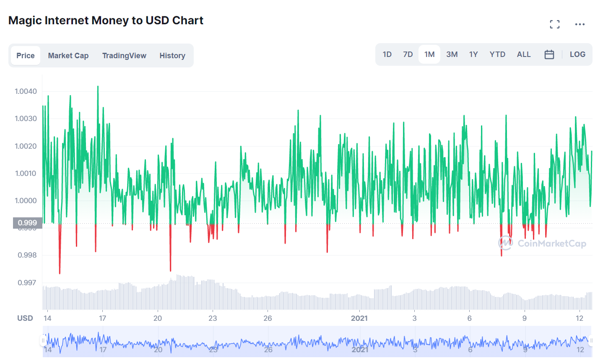

# AIP: Add MIM to Aave V2

ARC to https://governance.aave.com/t/add-mim-to-aave-v2/6970

## Simple Summary

MIM is a soft-pegged USD stablecoin minted by Abracadabra.money, a lending pool protocol that uses interest-bearing tokens as collateral to mint MIM.

## Abstract

Add MIM to the Aave V2 market.

Interest-bearing tokens that can currently be used as collateral include liquidity provider (LP) tokens such as yvYFI, yvUSDT, yvUSDC, and xSUSHI as well as tokens from Convex and Curve. MIM is the core component to sustain Abracadbra.Money’s lending model. MIM remains pegged to USD via arbitrage incentives within the Abracadabra ecosystem.

MIM is an ideal candidate to be included on Aave to provide more decentralized stablecoin alternatives.

## Motivation

The presence of stablecoins on Aave is a key benefit for lenders of the protocol, providing lenders borrow liquidity for stablecoins against volatile assets lent to Aave. MIM, a reliable and popular stablecoin in DeFi, would be an asset to Aave in this respect. MIM also brings a high volume of liquidity and motivated users, which would in turn direct more liquidity to Aave.

Already present on other lending protocols, MIM acts as a comparable alternative to stablecoins such as USDC, USDT, and DAI. The arbitrage incentives for MIM on Abracadabra also ensure that it will remain pegged to $1, typically done by automated bots that monitor pools for opportunities to capitalize on price differences. MIM has proven the stability of its peg over the past year. For example, the 30 day high and low for MIM are $1.03 and $0.9798, respectively. MIM is also ranked number six out of all stablecoins on the market based on market capitalization.

FRAX, a similar stablecoin listed on Aave, is also soft-pegged to USD and has remained at $1 since its launch in 2020. The 30 day high and low are similar to MIM, at $1.03 and $0.9825 respectively. FRAX is partially backed with on-chain collateral and partially backed algorithmically, a somewhat different approach to soft-pegging than MIM. However, both stablecoins have shown success in maintaining their pegs. Overall, Aave already supports soft-pegged stablecoins that are backed by mechanisms such as on-chain collateral, algorithms, and arbitrage incentives.

## Specification

### What is the link between the author of the AIP and the Asset?

Founder of Bribe Protocol, a novel DeFi protocol that creates DAO infrastructure tooling to incentivize protocol participation

### Provide a brief high-level overview of the project and the token

MIM is a USD soft-pegged stablecoin minted by Abracadabra.money using interest-bearing tokens as collateral

### Explain positioning of the token in the AAVE ecosystem. Why would it be a good borrow or collateral asset?

If listed, MIM would become an important stablecoin option for Aave lenders. As a reliable stablecoin, MIM provides a new opportunity for Aave users to borrow against volatile assets.

### Provide a brief history of the project and the different components: DAO (is it live?), products (are they live?). How did it overcome some of the challenges it faced?

MIM launched in early 2021 and currently has over $4.6B in circulating MIM. MIM has never broken the peg of $1 despite sharp market downturns since its launch. Abracadabra’s protocol token, SPELL, is used to incentivize users to maintain liquidity. Staked SPELL (sSPELL) is also used for fee-sharing and governance.

### How is the asset currently used?

MIM is currently used as a stablecoin in decentralized exchanges such as Curve, SushiSwap, and Uniswap.

### Emission schedule

There is no emission schedule; interest-bearing tokens are collateralised and injected into the system, after which they are minted into MIM tokens.

### Token & protocol permissions and upgradability

MIM tokens are minted by a 6/10 Multisign, deposited in the Kashi Markets smart contracts, and then injected into circulation after the user deposits the collaterals.

### Market data (Market Cap, 24h Volume, Volatility, Exchanges, Maturity)

- Market Cap: $4,637,898,723
- 24h Volume: $245,134,813
- Volatility: Extremely Low
- Maturity: Early-Mid

### Social channels data (Size of communities, activity on Github)

107.9K followers on Twitter, 41.2K members on Discord, Github is updated frequently.

### Contracts date of deployments, number of transactions, number of holders for tokens

- Date of Deployment: January 7th, 2021
- Number of Transactions: 129.7k+
- Number of Holders: 4.4k+

## Rationale

MIM offers a unique use case in that Abracadabra mints MIM for illiquid interest-bearing tokens. DeFi users get MIM, a liquid stablecoin, in return for these tokens. This has created a large user base of over 4.4K DeFi users who are seeking MIM in return for their interest-bearing tokens. Adding MIM to Aave not only brings these users, but provides another stablecoin for existing Aave lenders to take advantage of.

MIM is a natural next step for Aave when adding both an option for collateral and for depositing/lending.

## Test Cases

TODO: Test cases for an implementation are mandatory for AIPs but can be included with the implementation.

## Implementation

MIM will be used for depositing and lending as well as collateral, with the following suggested parameters to be finalized via Aave governance:

- Loan-to-Value (LTV): 75%
- Liquidation Threshold: 60%
- Liquidation Bonus: 5%
- Borrowing Enabled: yes
- Reserve Factor: 10%

## Note from the proposer, Bribe Protocol

Bribe is a new DeFi protocol that pays DAO token holders to govern. Our first protocol integration is Aave. We will be creating an Aave pool on Bribe where holders of AAVE and stkAAVE can deposit their tokens and earn rewards while other users bid for their voting power. Learn more about Bribe and how we’re integrating Aave here:

- [Hello world from Bribe](https://medium.com/bribe-protocol/hello-world-from-bribe-df3dd5d70087)
- [Introducing AAVE and stkAAVE Governance Pools](https://medium.com/bribe-protocol/bribe-introduces-aave-and-stkaave-governance-pools-300c0d4c6ff8)

## Audits / Security Reviews

Abracadabra.money: [Immunefi Bounty Program](https://immunefi.com/bounty/abracadabra/)

## References

Website - https://abracadabra.money/

Twitter - https://twitter.com/mim_spell

Docs - https://docs.abracadabra.money/

Github - [Abracadabra · GitHub](https://github.com/Abracadabra-money)

Token Contract - [$1.00 | Magic Internet Money (MIM) Token Tracker | Etherscan](https://etherscan.io/token/0x99d8a9c45b2eca8864373a26d1459e3dff1e17f3)

## Copyright

Copyright and related rights waived via [CC0](https://creativecommons.org/publicdomain/zero/1.0/).
