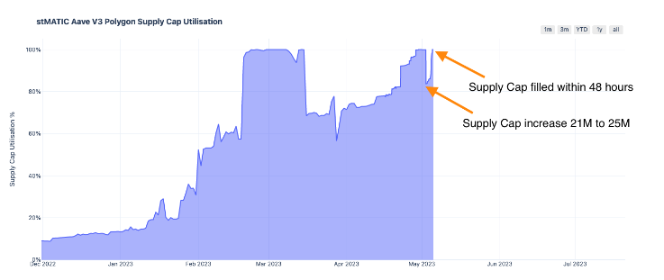

# Summary

This AIP increasing the following Supply Caps:

* stMATIC Supply Cap on Polygon from 25.0M to 30M units
* wstETH on Polygon v3 from 1,800 units to 2,400 units
* wstETH on Abritrum from 4.65k unit to 9,300 units

# Abstract

This publication present the community the opportunity to increase three Supply Caps across two Aave v3 deployments. Each asset is currently at, or nearing, 100% utilisation.  Some assets are receiving deposit rewards from Lido DAO.

Increasing the Supply Caps will enable users to enter yield maximising strategies, creating borrowing demand for network tokens that generates revenue for Aave DAO.

Each of the parameter changes presented have been reviewed and are endorsed by at least one risk service provider. 

# Motivation

## stMATIC Supply Cap Polygon

Recently, the Supply Cap of stMATIC was increased from 21M units to 25M units. Within a few days, the Supply Cap was reached.

The above chart shows the pent up demand awaiting Supply Cap increases. The right most part of the chart shows a rapid increase in utilisation as soon as the Supply Cap was lifted.

The recent increase in stMATIC deposits is from users entering the yield maximising strategy. This type of interaction with Aave Protocol is deemed lower risk than borrowing less price correlated assets.

The chart above shows that the supply of stMATIC on Polygon has only increased notably over the last few days. 50% of supply is 25,825,944 which can be rounded to 25.8M units. This AIP presents a stMATIC Supply Cap of 30M units, or 58.08% of supply.

## wstETH Supply Cap Polygon

Current utilisation of the wstETH Supply Cap is 100%. Supply of wstETH on Polygon is [4,034 units](https://polygonscan.com/token/0x03b54a6e9a984069379fae1a4fc4dbae93b3bccd). 

As the majority of larger holdings are entering into the yield maximising strategy and the oracle draws upon liquidity from DEXs across various networks and CEX, Aave Protocol can be more flexible with setting the Supply Cap.

As a result, this AIP will implement a Supply Cap that is approximately 59.49% of supply. This is equivalent to a 33% increase in the Supply Cap.

## wstETH Supply Cap Arbitrum

The wstETH Supply Cap on Arbitrum v3 is at 100% utilisation. 

There is ample liquidity for wstETH to wETH to USDC swaps to occur when liquidating the largest wstETH holdings. At the time of writing, wstETH supply on Arbitrum is [34,699.59 units](https://arbiscan.io/token/0x5979d7b546e38e414f7e9822514be443a4800529), 50% of the supply is 17.35k units. The wstETH Supply Cap is to be increased by 100% to 9,300 units.

# Specification

The following risk parameters changes are presented:

**Polygon** 

Ticker: stMATIC

Contract: [`polyon: 0x3a58a54c066fdc0f2d55fc9c89f0415c92ebf3c4`](https://polygonscan.com/address/0x3a58a54c066fdc0f2d55fc9c89f0415c92ebf3c4)

|Parameter|Current Value|Proposed Value|
| --- | --- | --- |
|SupplyCap|25M units|30M units|

Ticker: wstETH

Contract: [`polygon: 0x03b54A6e9a984069379fae1a4fC4dBAE93B3bCCD`](https://polygonscan.com/token/0x03b54A6e9a984069379fae1a4fC4dBAE93B3bCCD)

|Parameter|Current Value|Proposed Value|
| --- | --- | --- |
|SupplyCap|1,800 units|2,400 units|

**Arbitrum** 

Ticker: wstETH

Contract: [`arbitrum: 0x5979D7b546E38E414F7E9822514be443A4800529`](https://arbiscan.io/token/0x5979d7b546e38e414f7e9822514be443a4800529)

|Parameter|Current Value|Proposed Value|
| --- | --- | --- |
|SupplyCap|4,650 units|9,300 units|

# Implementation

A list of relevant links like for this proposal:

**Polygon stMATIC**

* [stMATIC Governance Forum Discussion](https://governance.aave.com/t/arfc-stmatic-supply-cap-increase-polygon-v3/12606)
* [Test Cases](https://github.com/bgd-labs/aave-proposals/blob/main/src/AaveV3CapsUpdates_20230508/AaveV3MultiCapsUpdate_20230508_PayloadTest.t.sol)
* [Payload Implementation](https://github.com/bgd-labs/aave-proposals/blob/main/src/AaveV3CapsUpdates_20230508/AaveV3PolCapsUpdates_20230508_Payload.sol)

**Polygon wstETH**

* [wstETH Governance Forum Discussion](https://governance.aave.com/t/arfc-increase-wsteth-supply-cap-on-polygon-v3/12971)
* [Test Cases](https://github.com/bgd-labs/aave-proposals/blob/main/src/AaveV3CapsUpdates_20230508/AaveV3MultiCapsUpdate_20230508_PayloadTest.t.sol)
* [Payload Implementation](https://github.com/bgd-labs/aave-proposals/blob/main/src/AaveV3CapsUpdates_20230508/AaveV3PolCapsUpdates_20230508_Payload.sol)

**Arbitrum wstETH**

* [Governance Forum Discussion](https://governance.aave.com/t/arfc-wsteth-supply-cap-increase-arbitrum-v3/13016)
* [Test Cases](https://github.com/bgd-labs/aave-proposals/blob/main/src/AaveV3CapsUpdates_20230508/AaveV3MultiCapsUpdate_20230508_PayloadTest.t.sol)
* [Payload Implementation](https://github.com/bgd-labs/aave-proposals/blob/main/src/AaveV3CapsUpdates_20230508/AaveV3ArbCapsUpdates_20230508_Payload.sol)

Risk Service providers have endorsed the contents of this proposal. 

The proposal Payload was reviewed by [Bored Ghost Developing](https://bgdlabs.com/).

# Copyright

Copyright and related rights waived via [CC0](https://creativecommons.org/publicdomain/zero/1.0/).