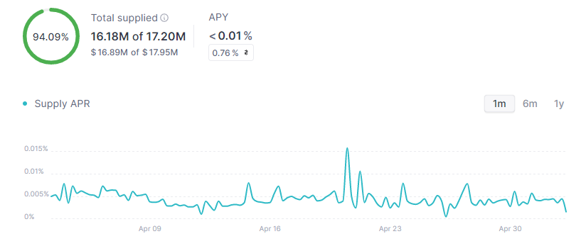

# Summary

This publication proposes increasing the MaticX Supply Cap on Polygon v3 from 17.2M units to 29.3M units.

# Abstract

After a vote for increasing the communities counter party risk was passed on Snapshot, the Supply Cap for MaticX can be increased from 50% to 75% of circulating supply.

The dominant use case for MaticX on Aave Protocol is as collateral to borrow wMATIC. Since the MaticX oracle, a calculated price feed provided by Chainlink based upon the underlying asset's (MATIC) price, the risk of liquidation is minimal. As a result, the primary risk of increasing aave Protocol's exposure to MaticX is the assocaited counterparty risk which is expressed as concentration risk with up to 75% of supply on the Polygon network.

The current Supply Cap's utilisation is hovering around 94%, with 1.03M units of MaticX deposit capacity. Stader Labs is currently offering SD rewards to user who deposit MaticX. This proposal seeks to encourage Stader Labs to continue distributing SD rewards by increasing the Supply Cap and enabling more MaticX to be deposited into Aave. 

# Motivation

Over the previous months, Llama has been working with various communities to craft favourable conditions conducive to growing TVL and Revenue by facilitate the creation of several yield aggregation products. 

With liquidity mining ongoing, MaticX deposit rewards (SD) and wMATIC borrowing rewards (stMATIC & MaticX), ensuring there is adequate capacity enabling the yield maximising strategies to grow is key for Aave Protcol's abililty to generate wMATIC revenue. Several liquidity pools on Balancer v2 now include bb-a-wMATIC with over 14.5M units of wMATIC being deposited in Aave Protocol. This has lead to reduced borrowing rates for wMATIC and supports the continued growth of yield maximising strategies on Aave Protocol. 

To facilitate the continued growth of the MaticX reserve, the Supply Cap needs to be raised enabling more deposits into the reserve.

With reference to the new [ARFC Aave V3 Caps update Framework](https://governance.aave.com/t/arfc-aave-v3-caps-update-framework/11937/1) the preferred path forward is to implement several upgrades to gradually increase Aave's MaticX exposure over time. 

This proposal will increase the Supply Cap from 17.2M units to  29.3M units. Feedback from Chaos Labs and Gauntlet can be found [here](https://governance.aave.com/t/arfc-maticx-supply-cap-increase-polygon-v3/12657/13). The two appllicable Snapshot votes can be founds [here](https://snapshot.org/#/aave.eth/proposal/0xf9261916c696ce2d793af41b7fe556896ed1ff7a8330b7d0489d5567ebefe3ba) and [here](https://snapshot.org/#/aave.eth/proposal/0x7057a6311c791ebd57b93acb4a231dfd4fb92755fc02fa1de4723d0a5510d2ed).

# Specification

Ticker: MaticX

Contract: [`polygon: 0xfa68FB4628DFF1028CFEc22b4162FCcd0d45efb6`](https://polygonscan.com/token/0xfa68fb4628dff1028cfec22b4162fccd0d45efb6)

|Parameter|Current Value|Proposed Value|
| --- | --- | --- |
|SupplyCap|17.2M units|29.3M units|

# Implementation

A list of relevant links like for this proposal:

* [Governance Forum Discussion](https://governance.aave.com/t/arfc-maticx-supply-cap-increase-polygon-v3/12657)
* [Test Cases](https://github.com/bgd-labs/aave-proposals/blob/main/src/AaveV3CapsUpdates_20230503/AaveV3PolCapsUpdates_20230503_PayloadTest.t.sol)
* [Payload Implementation](https://github.com/bgd-labs/aave-proposals/blob/main/src/AaveV3CapsUpdates_20230503/AaveV3PolCapsUpdates_20230503_Payload.sol)

The proposal Payload was reviewed by [Bored Ghost Developing](https://bgdlabs.com/).

# Copyright

Copyright and related rights waived via [CC0](https://creativecommons.org/publicdomain/zero/1.0/).
