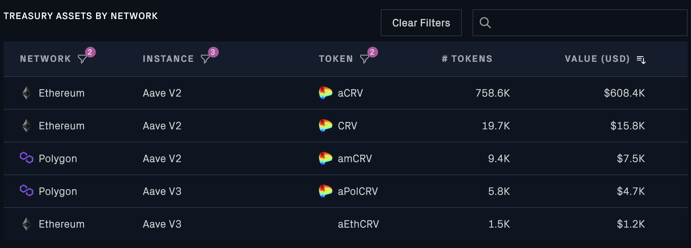

# Summary

This publication proposes depositing CRV into a Stake DAO contract to mint and stake sdCRV for yield.

# Abstract

The Aave DAO voted to deposit CRV into Stake DAO's liquidity locker contracts with the goal of minting sdCRV and staking sdCRV for yield.

The intention is for all yield generated from this strategy to be periodically claimed, swapped to CRV and used to compound the staked sdCRV position.

The publication handles the first part of strategy which is to deposit CRV, mint sdCRV, and stake sdCRV for yield.

# Motivation

Aave currently holds 795k of CRV across Ethereum and Polygon networks. The vast majority, 758.6k, was earned as interest in the form of aCRV on Aave v2 and 1.5k from Aave v3. 19.7k was received from the excess debt swap contract. 

The equivalent of 15.2k CRV is also held on Polygon, which will be transferred to Ethereum and deposited into the sdCRV strategy at a later date. This publication will focus solely on the Ethereum CRV correlated asset holdings. 

Three options for how to invest the CRV holdings were discussed on the governance forum with the community electing to proceed with the [sdCRV option](https://snapshot.org/#/aave.eth/proposal/0xf92c5647c7f60a4a3db994b4953fc4408f5946cafdc0cebcd4c5924f40e04d36).

# Specification

In order for the Collector Contract to receive sdCRV, the following steps will be implemented in a payload contract to be submitted via governance vote.

The following steps take place in a single transaction:

1. Transfer [aCRV](https://etherscan.io/address/0x8dAE6Cb04688C62d939ed9B68d32Bc62e49970b1) from the Collector contract into the payload contract being executed
2. Transer [aEthCRV](https://etherscan.io/address/0x7B95Ec873268a6BFC6427e7a28e396Db9D0ebc65) from Collector contract into the payload contract being executed.
3. Transfer [CRV](https://etherscan.io/address/0xd533a949740bb3306d119cc777fa900ba034cd52) from the Collector contract into the payload contract being executed
4. Withdraw all aCRV into CRV
5. Withdraw all aEthCRV into CRV
6. Deposit all CRV now held into the [StakeDAO's CRVDepositor](https://etherscan.io/address/0xc1e3Ca8A3921719bE0aE3690A0e036feB4f69191). The CRV will be [locked](https://stakedao.gitbook.io/stakedaohq/platform/liquid-lockers/how-do-liquid-lockers-work) and the sdCRV received will be staked to earn yield.
7. The Collector contract will now have a positive balance (1:1 CRV to sdCRV) held on the [Gauge](https://stakedao.gitbook.io/stakedaohq/tutorials/liquid-lockers/voting-on-gauges) for sdCRV.

The relevant StakeDAO addresses can be found [here](https://stakedao.gitbook.io/stakedaohq/platform/liquid-lockers/sdtokens/crv-liquid-locker).

# Implementation

A list of relevant links like for this proposal:

* [Governance Forum Discussion](https://governance.aave.com/t/arfc-deploy-acrv-crv-to-vecrv/11628/42)
* [Test Cases](https://github.com/bgd-labs/aave-proposals/blob/main/src/AaveV3sdCRV_20230503/AaveV3EthsdCRV_20230503_PayloadTest.t.sol)
* [Payload Implementation](https://github.com/bgd-labs/aave-proposals/blob/main/src/AaveV3sdCRV_20230503/AaveV3EthsdCRV_20230503_Payload.sol)

The proposal Payload was reviewed by [Bored Ghost Developing](https://bgdlabs.com/).

# Copyright

Copyright and related rights waived via [CC0](https://creativecommons.org/publicdomain/zero/1.0/).