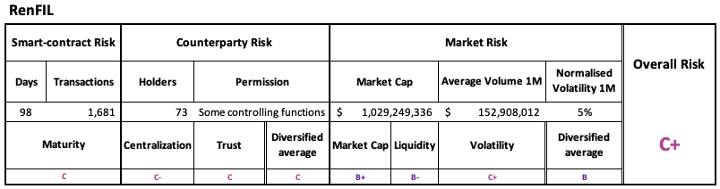
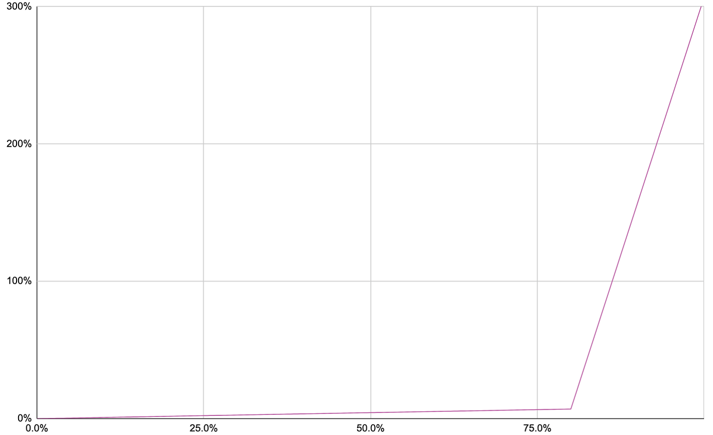

## Simple Summary


Add depositing and borrowing (not collateral) support for renFIL to the Aave market. renFIL is a wrapped version of [Filecoin](https://filecoin.io/) using [Ren Protocol](https://renproject.io/).

## Abstract


[Filecoin](https://filecoin.io/) brings decentralized storage to DeFi, and [renFIL](https://renproject.io/) allows all types of new decentralized applications to be built to further the space. But these applications need a robust lending market to thrive, so storage miners can borrow renFIL/FIL to stake and FIL holders can earn a return on their holdings.

This proposal describes adding depositing and borrowing (not collateral) support for renFIL to the Aave market to unlock these new applications, expose the Filecoin community to Aave, and create a large new market on the protocol. [Ren Protocol](https://renproject.io/) was chosen as the tokenization service because it is already managing large bridges in production, including [$301 million in renBTC](https://www.coingecko.com/en/coins/renbtc) as of this writing. Collateral support for renFIL may be added later, but we recommend waiting for more price stability of FIL and renFIL before enabling.

## Motivation


Filecoin, and by extension, renFIL is unlike any other digital asset currently available in the Aave market, as it allows the purchase of hosting space on the permissionless Filecoin network. As a result, being able to lend and borrow renFIL will unlock many new DeFi applications, including:

* Storage mining syndicates
* Data markets
* Shared UIs/images/content
* Lossless capital hosting

Just see the recent [EthGlobal<>Protocol Labs Hackathon](https://hack.ethglobal.co/hackfs/showcase) and [Filecoin Launchpad](https://www.filecoinlaunchpad.co/)for hints of what is possible at the intersection of Filecoin+DeFi. The Filecoin community is massive and growing everyday, however, many of the participants are unfamiliar with Aave and DeFi. Adding renFIL to Aave would dramatically increase support for these efforts, would bring Filecoin users/developers into the Aave ecosystem, and allow capital, yield, and value to accrue to Aave participants.

## Specification


### Project
Filecoin is a distributed storage network based on a blockchain mechanism. Filecoin miners can elect to provide storage capacity for the network, and thereby earn units of the Filecoin cryptocurrency (FIL) by periodically producing cryptographic proofs that certify that they are providing the capacity specified. In addition, Filecoin enables parties to exchange FIL currency through transactions recorded in a shared ledger on the Filecoin blockchain. Rather than using Nakamoto-style proof of work to maintain consensus on the chain, however, Filecoin uses proof of storage itself: a miner’s power in the consensus protocol is proportional to the amount of storage it provides.

Filecoin was founded in 2015 by [Juan Benet](https://twitter.com/juanbenet), has been backed by Sequoia Capital, Andreessen Horowitz, and Union Square Ventures, and its mainnet went live on October 15, 2020. The network is governed by the Filecoin Foundation and the Filecoin Foundation for Decentralised Web.

## Rationale


The REN token is already supported in the Aave market, and renBTC is one of the most popular cross-chain tokens today. In unifying the Filecoin and DeFi ecosystems, Ren protocol is a natural bridge and has the technical expertise and experience to get the job down securely and safely.


## Implementation


The Filecoin price oracle will be served via [ChainLink](https://chain.link/), which includes both [FIL/ETH and FIL/USD feeds](https://docs.chain.link/docs/ethereum-addresses).

The renFIL token will only be used for depositing and lending, not as collateral. The following strategy params are proposed:

```
IReserveParams = {
  optimalUtilizationRate: new BigNumber(0.8).multipliedBy(oneRay).toFixed(),
  baseVariableBorrowRate: '0',
  variableRateSlope1: new BigNumber(0.07).multipliedBy(oneRay).toFixed(),
  variableRateSlope2: new BigNumber(3).multipliedBy(oneRay).toFixed(),
  stableRateSlope1: '0',
  stableRateSlope2: '0',
  baseLTVAsCollateral: '0',
  liquidationThreshold: '0',
  liquidationBonus: '0',
  borrowingEnabled: true,
  stableBorrowRateEnabled: false,
  reserveDecimals: '18',
  aTokenImpl: eContractid.AToken,
  reserveFactor: '3500'
};
```

Following the steps from the [Aave governance docs](https://docs.aave.com/developers/protocol-governance/governance/propose-your-token-as-new-aave-asset), the following contracts were generated:

```
    New interest bearing asset deployed on main:
    Interest bearing aRENFIL address: 0x5CAF29fD8efbe4ED0cfc43A8a211B276E9889583
    Variable Debt variableDebtRENFIL address: 0x4B20f007d0c1567Ca8a6e80B8a8EE19Ac59C6a08
    Stable Debt stableDebtRENFIL address: 0xf22b80D58a7cCDEd772E0997AE90a6C77940B051
    Strategy Implementation for RENFIL address: 0xb140cb1306B396c658A5438602b6857842E1E98a
```

### Test Cases


## Audits/Security Reviews
[Ren Protocol audits from ChainSecurity, ConsenSys Diligence, and Trail of Bits](https://github.com/renproject/ren/wiki/Audits)

[Filecoin audits and bug bounty](https://security.filecoin.io/)

[AAVE Community renFIL Risk Assement](https://governance.aave.com/t/proposal-add-support-for-renfil-filecoin/1059/17?u=corbpage)



[**RenFIL Smart contract Risk**](https://ethplorer.io/address/0xd5147bc8e386d91cc5dbe72099dac6c9b99276f5): **C**

RenVM is a byzantine fault-tolerant network that is able to securely in a decentralized manner do ECDSA threshold key generation and signing via sMPC, which allows RenVM to securely manage private keys of different assets like Bitcoin and Filecoin, and wrap these assets on smart-contract chains. Since launch, RenVM has processed around $1.5B in total volume of Bitcoin, Filecoin, Zcash, Bitcoin cash going to and from Ethereum. The smart contract risks of RenFIL are mitigated by those of RenBTC which has been battle tested by the markets.

Technically, renFIL is a proxied token standard ERC with some features on top:

* Mechanism of exchange rate (similar to Aave slashing)
* Permit for approvals
* Recovery of other tokens sent to the contract

**RenFIL Counterparty Risk: C**

There is a proxy admin which can update all the logic of the contract with a 7 days timelock controller by a multisig, controlled by the team. Even with 7 days, it may be impossible to mitigate the consequences of a contract upgrade with minting for example.

Furthermore there is an EOA (Externally Owned Account) with permissions to mint, burn, change the exchange rate and decide which tokens sent by mistake to the renFIL contract are recoverable.

This results in the capability to burn tokens of a particular address (potentially the ones contained in aToken) and the change of the implementation under the proxy.

[RenFIL Market 1](https://www.coingecko.com/en/coins/renfil): **Risk B (based on FIL)**

RenFIL market capitalisation is unknown with very little liquidity in the markets. The redemption process is permissionless enabling smooth liquidations into the liquidity of FIL.

**Risk Parameters**

Given the centralisation of RenFIL it can only be listed as borrow asset.

Reserve Factor 35%

**Variable Interest Rate Model** 

UOptimal 80% (since not a collateral)

R_0 0%

R_s1 7%

R_s2 300%



## References
* [Filecoin Website](https://filecoin.io/)
* [Filecoin Spec](https://spec.filecoin.io/)
* [Ren Protocol](https://renproject.io/)
* [renFIL Token](https://etherscan.io/token/0xD5147bc8e386d91Cc5DBE72099DAC6C9b99276F5)

## Copyright

Copyright and related rights waived via [CC0](https://creativecommons.org/publicdomain/zero/1.0/).