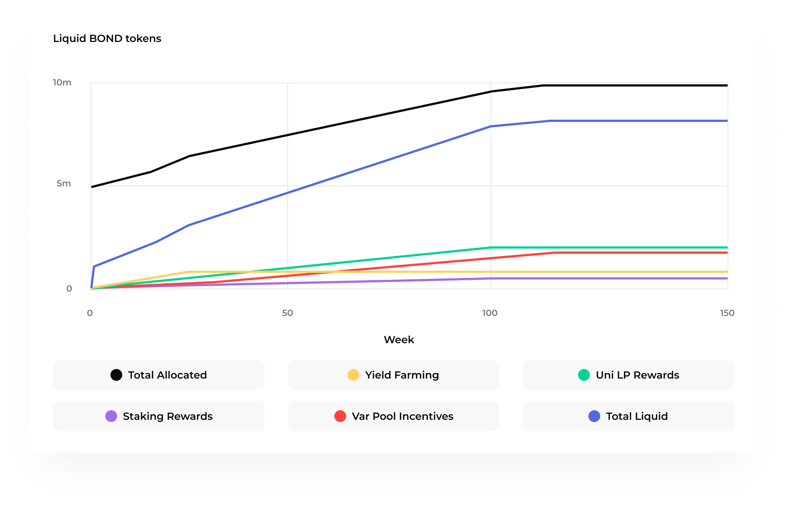
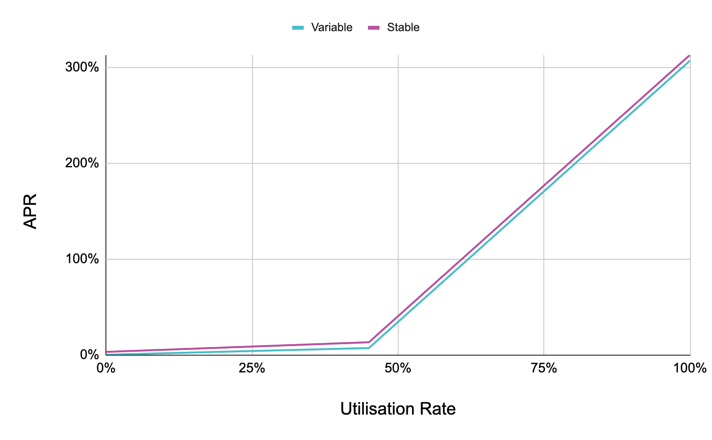

## Simple Summary

We are proposing to add BarnBridge (BOND) to Aave as collateral.

## Abstract

BarnBridge is building a suite of applications that allows users to mitigate risk across various use cases throughout DeFi. These applications rely on differentiated user profiles, referred to as tranches, in order to create markets for risks such as interest rate fluctuations and asset price volatility. Currently, SMART Yield on Ethereum mainnet has some $290M in TVL, while SMART Exposure and SMART Alpha are slated for Q3 of 2021. The BOND token is used to govern the BarnBridge DAO and allocate protocol resources.

## Motivation

BarnBridge is one of a handful of DAOs noted for its sizable allocation of its own native asset (see: open-orgs.info). It currently holds over 30% of the total BOND supply.

Adding BOND to Aave would provide a mechanism through which the DAO could finance growth, decreasing the need for excessive token distributions. Example use cases include: funding projects building on top of BarnBridge applications, paying salaries to key protocol participants, and hosting bug bounties that earn yield until paid out.

BarnBridge earns fee revenues from both deposits of underlying assets and redemptions of derivative assets. By adding BOND as collateral, the DAO and individual BOND holders can borrow against their position, increasing stablecoin demand and utilization on Aave v2. Additionally, BOND holders can lend out their position for a yield on Aave v2. Given BarnBridge’s direct role as an Aave liquidity provider, the addition of BOND to Aave v2 creates more synergies between Aave and BOND holders.

To start, it may make sense for BOND to have a conservative LTV and liquidation threshold which can be fine tuned further down the line.

## Specification

1. What is the link between the author of the AIP and the Asset?
  
  - Seed investor in BarnBridge

2. Provide a brief high-level overview of the project and the token
  
  - BarnBridge is a risk tokenizing protocol. It aims to reduce the risks associated with DeFi, such as inflation risk, market price risk, and cash-flow volatility   risk. By letting users select a risk profile, BarnBridge can redistribute risk via tokenized, liquid tranches. BarnBridge does this with its SMART Yield, SMART   Exposure, and SMART Alpha products, all of which address a specific DeFi risk category.

  - BOND token is a governance token that powers the BarnBridge DAO protocol. BOND is an ERC-20 token. Token holders have the ability to govern the network by       staking their holdings in return for the right to participate in on-chain voting and make decisions on the protocol development.

  - BOND total supply: 10,000,000 (minting function is disabled).
  - Token contract address: [`0x0391D2021f89DC339F60Fff84546EA23E337750f`](https://etherscan.io/address/0x0391D2021f89DC339F60Fff84546EA23E337750f)

3. Explain positioning of token in the Aave ecosystem. Why would it be a good borrow or collateral asset?
  
  - By adding BOND as collateral, the DAO and individual BOND holders can borrow against their position, increasing stablecoin demand and utilization on Aave v2. Additionally, BOND holders can lend out their position for a yield on Aave v2. Given BarnBridge’s direct role as an Aave liquidity provider, the addition of BOND to Aave v2 creates more synergies between Aave and BOND holders. BarnBridge currently provides ~$180M in liquidity to Aave v2 and will be launching a similar integration on Polygon in July.

4. Provide a brief history of the project and the different components: DAO (is it live?), products (are the live?). How did it overcome some of the challenges it faced?
  
  - BarnBridge was founded in September 2020. Since that time, BarnBridge succeed in launching the BarnBridge DAO and delivering a SMART Yield product which currently holds $280M+ in TVL with $178M providing to Aave. With the upcoming SMART Yield and SMART Exposure launch on Polygon, followed by the product we call SMART Secret and SMART Alpha (later) BarnBridge will be a full-established protocol with plenty of products and potentially with 1B+ in TVL after all our products launch.

5. How is the asset currently used?
  
  - BOND token is currently used for:

     - Staking in BarnBridge DAO to get exposure to voting rights in the DAO.
     - Liquidity providing on Uniswap, Sushiswap, and Bancor.
     - Lending on Cream finance.

6. Emission schedule
  
  

7. Token & protocol permissions and upgradeability
  
  - Protocol is upgraded by the BarnBridge DAO.  We used the Diamond Standard on a couple parts of the protocol so we could do seamless upgrades.  A users token "power" determines their vote weight and control they have in the DAO.

8. Market data (Market Cap, 24h Volume, Volatility, Exchanges, Maturity)
  
  - Market cap: $96M
  - 24h Volume: $5.7M
  - Volatility: high
  - Exchanges: Coinbase, Uniswap, Bancor, Gemini

9. Social channels data (Size of communities, activity on Github)
  
  - Twitter: 19.4K
  - Discord: 6.2K
  - Medium: 4.1K

10. Contracts date of deployments, number of transactions, number of holders for tokens
  
  - Transactions: 116K
  - Token holders: 6.3k

## Rationale

BarnBridge will continue to grow as a distributor of Aave v2 stablecoin markets as its SMART Yield integration gains further traction. There are currently ~$180M worth of stablecoins deposited into Aave v2 through SMART Yield. This liquidity is provided without any expectation of being used, meaning BarnBridge is a pure liquidity provider for Aave. BarnBridge is also actively building an integration with Aave’s Polygon market. Future BarnBridge products, including SMART Alpha senior tranches for assets like wBTC and ETH, stand to provide Aave with relatively safer collateral given their ability to mitigate price drawdowns. 

## Test Cases

Test cases for an implementation are mandatory for AIPs but can be included with the implementation.

## Implementation

### Contracts

- Interest bearing aBOND address: [`0x848bCacE91a2f3dbBd692580d482C63933cdE3A9`](https://etherscan.io/address/0x848bCacE91a2f3dbBd692580d482C63933cdE3A9)
- Variable Debt variableDebtBOND address: [`0xffE2af52CBc96C0e21Ce76428371747c14572619`](https://etherscan.io/address/0xffE2af52CBc96C0e21Ce76428371747c14572619)
- Stable Debt stableDebtBOND address: [`0xC26063FC1CfE2f86a77Ef3E87aDA3a75a4F5c5D2`](https://etherscan.io/address/0xC26063FC1CfE2f86a77Ef3E87aDA3a75a4F5c5D2)
- Strategy Implementation for BOND address: [`0x17e64934E5a953a1DD355c664Ad0a19aeb69b6b0`](https://etherscan.io/address/0x17e64934E5a953a1DD355c664Ad0a19aeb69b6b0)

### Price oracle

The BOND price oracle will be served via [ChainLink](https://chain.link/), which includes the [BOND/ETH](https://docs.chain.link/docs/ethereum-addresses) feed, [here](https://etherscan.io/address/0xdd22A54e05410D8d1007c38b5c7A3eD74b855281).

### Interest model

- LTV 25%
- Liquidation Threshold 35%
- Liquidation Bonus 15%
- Reserve Factor 35%

Interest Rate Model

- UOptimal 45%

Variable:

- R_0 0%
- R_s1 7%
- R_s2 300%

Stable:

- R_s1 10%
- R_s2 300%

## References

- *Website*: https://www.BarnBridge.com
- *DAPP*: https://app.barnbridge.com/
- *Whitepaper*: https://github.com/BarnBridge/BarnBridge-Whitepaper
- *Project Management Portal*: https://github.com/BarnBridge/BarnBridge-PM
- *Youtube*: https://www.youtube.com/c/BarnBridge
- *Twitter*: https://twitter.com/Barn_Bridge
- *BOND token contract*: https://etherscan.io/address/0x0391D2021f89DC339F60Fff84546EA23E337750f

## Copyright

Copyright and related rights waived via [CC0](https://creativecommons.org/publicdomain/zero/1.0/).
