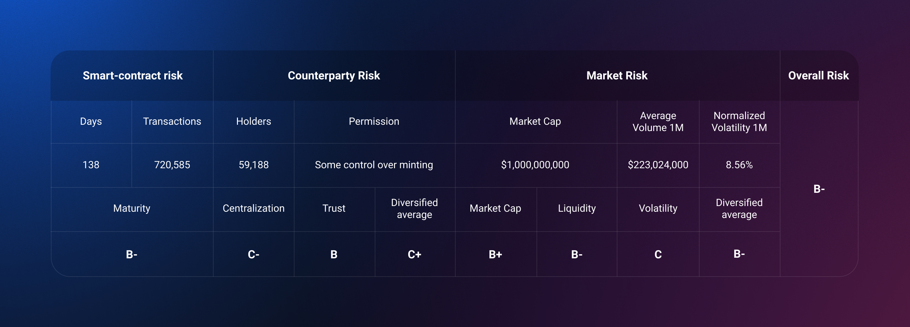
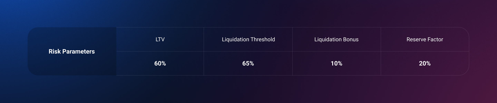
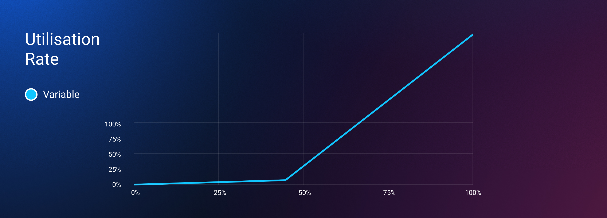
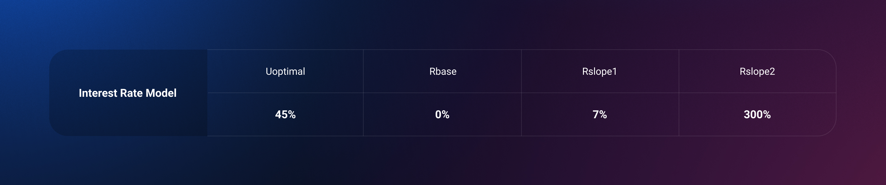

## AIP rationale

1inch Network is arguably one of the most reputable and trusted ecosystems that unites decentralized protocols whose synergy enables the most lucrative, fastest and protected operations in the DeFi space. It consists of 6 distinct yet interoperable components: The 1inch Aggregation Protocol, the 1inch Liquidity Protocol, 1inch DAO, 1inch Mobile Wallet, 1inch Labs, 1inch Foundation.

1INCH is an ERC-20 utility & governance token, and the 1inch Network is governed by a decentralized autonomous organization (DAO). 1inch is unique in that it provides instant governance for its users. This feature allows 1inch users to vote for specific protocol settings in the DAO model. The instant governance makes it easier for token holders to make changes to the protocol and circumnavigates many of the inefficiencies of many current DAO models.

## **References**

- [Forum proposal and poll](https://governance.aave.com/t/proposal-add-support-for-1inch-token/2158/22)
- Project: [1inch.io](https://1inch.io/)
- [Whitepaper](https://mooniswap.exchange/docs/MooniswapWhitePaper-v1.0.pdf)
- [Document portal](https://help.1inch.io/en/)
- [Source code](https://github.com/1inch)
- [Ethereum addresses contracts](https://www.notion.so/1117dc0aa78b770fa6a738034120c302)
- [Audits](https://github.com/1inch-exchange/1inch-v2-audits)
- [Dune Analytics](https://duneanalytics.com/k06a/1inch-exchange)
- [Coingecko](https://www.coingecko.com/en/coins/1inch)

## Communities

- [Twitter](https://twitter.com/1inchNetwork)
- [Governance forum](https://gov.1inch.exchange/)
- [Discord](https://discord.com/invite/FZADkCZ)
- [Medium](https://blog.1inch.io/)
- [YouTube](https://www.youtube.com/channel/UCk0nvK4bHpteQXZKv7lkq5w)
- [Telegram](https://t.me/OneInchNetwork)
- [GitHub](https://github.com/1inch)
___

## **Paragraph Summary**

1inch Network is arguably one of the most reputable and trusted ecosystems that unites decentralized protocols whose synergy enables the most lucrative, fastest and protected operations in the DeFi space. It consists of 7 distinct yet interoperable components: The 1inch Aggregation Protocol, the 1inch Liquidity Protocol, 1inch DAO, 1inch Mobile Wallet, 1inch Labs, 1inch Foundation, 1inch Limit Order Protocol. 1inch Network has recently surpassed over $53B in cumulative volume.

The initial protocol of the 1inch Network is a DEX aggregator solution that searches deals across multiple liquidity sources, offering users the best rates on the market.  Over 60 liquidity sources on Ethereum, 30 liquidity sources on Binance Smart Chain and 12 on Polygon supported. Our algorithm is able to find the most efficient path across multiple DEXes, preventing users from interaction with an unsafe liquidity source and offering the best rate on the market.

## Motivation

This is a proposal for adding the 1inch token (1INCH) to AAVE as a collateral. We believe 1INCH would be a valuable addition with its reliable live price feeds, strong community interest, and sufficient market liquidity.
___

### Why 1INCH?
**Popularity**
1INCH has been listed on Coinbase, Binance, Revolut, Gemini and other significant exchanges currently ranks in the top 100 of total coins by market capitalization. 1INCH has a flourishing community of over 300,000+ members across multiple online channels, as well as more than 475,000+ active wallets and 65,000+ token holders. We believe that the addition of our token to AAVE will step up activity on the platform and provide a vast number of opportunities to the communities of both projects.

**Transparency**
1INCH is an ERC-20 utility & governance token, and the 1inch Network is governed by a decentralized autonomous organization (DAO). 1inch is unique in that it provides instant governance for its users. This feature allows 1inch users to vote for specific protocol settings in the decentralized autonomous organization (DAO) model.

**Liquidity**
1INCH is at over $1B in market cap at the time of writing. It has deep liquidity on both centralized and decentralized exchanges.

**Defi Adoption**
1INCH is an active project in the Defi ecosystem and has already submitted applications to the MakerDAO and Compound communities.
___

## Specification

**What is the link between the author of the AIP and the Asset?**

Active core contributor of the project [1inch.io/contributors](https://1inch.io/contributors/)

**Provide a brief high-level overview of the project and the collateral token**

See Summary & Motivation

**Explain positioning of the token in the AAVE ecosystem: which market?**

The asset will be listed in the current AAVE V2 market

**Provide a brief history of the project and how it overcame stressed conditions**

Founded in May 2019, 1inch.io is the brainchild of engineers Sergej Kunz and Anton Bukov. Kunz and Bukov both have strong backgrounds in smart contract auditing. The 1inch.io blueprint was created ahead of the ETHNewYork convention. During the event, the first medium viable product (MVP) was created for 1inch.exchange. This iteration aggregated liquidity from decentralized exchanges (DEXs) Bancor, Kyber and Uniswap.

The project gained organic traction and later attracted funding. The first round was led by Binance Labs and Pantera Capital led the second round.

**How is the asset currently used?**

1INCH is an ERC-20 utility & governance token, and the 1inch Network is governed by a decentralized autonomous organization (DAO). 1inch is unique in that it provides instant governance for its users. This feature allows 1inch users to vote for specific protocol settings in the DAO model. The instant governance makes it easier for token holders to make changes to the protocol and circumnavigates many of the inefficiencies of many current DAO models.

**Market data (Market Cap, 24h Volume, Volatility, Exchanges, Maturity)**

[coingecko.com/en/coins/1inch](https://www.coingecko.com/en/coins/1inch)

**Social channels data**

See links above
___

## **Risk Assessment and Parameter suggestions**

Here is an analysis based on other similar projects risk parameters to quantify 1INCH risks and the resulting model parameters suggestions

### **1INCH’s Overall Risk is B-**

The table below shows the key metrics used for the analysis as well as the risk scores using data from CoinGecko as of 10/05/2021. 1INCH is the governance token of the 1inch Network with the all time total volume over $35B.

### **1INCH Smart Contract Risk: B-**

1INCH token was introduced to 1inch Network in December 2020 through community distribution. The code has multiple audits from top-notch security firms. See [github.com/1inch-exchange/1inch-v2-audits](https://github.com/1inch-exchange/1inch-v2-audits). It is central in the DAO operations enabling stakers to vote for specific protocol settings, such as Swap Fee, Price Impact Fee, Decay Period, Governance Reward, Referral Reward. This model has generated over 700K transactions in less than half a year, with around 59,000+ token holders.

### **1INCH Counterparty Risk: C+**

The 1inch Network operates as a decentralised organisation.The independent forming board of the 1inch Foundation from the Cayman Islands has released and issued 1INCH tokens and 1INCH tokens are under the control of 1inch Foundation; one of the objects of which is to develop and incentivize the growth of a 1inch Network protocols.

### **1INCH Market Risk: C**

1INCH is one of the leading DeFi projects. The token is available on top exchanges, such as Coinbase, Binance and Gemini with nearly $1B market capitalisation and over $200M average daily volume. It has deep liquidity on both centralized and decentralized exchanges.

### Risk Parameters

### Variable Interest Rate Model

1INCH fits the profile of a collateral asset, with the need for a conservative borrow rate model with a low optimal utilisation to protect collateral liquidity.

## Code
The code is part of the standard Aave protocol deployment (the AToken, Debt tokens and interest rate strategy) therefore no audits are needed. The code can be found here https://github.com/aave/protocol-v2/tree/master/contracts/protocol/tokenization

## Test Cases

Being a standard ERC20, the Aave protocol test cases already cover everything needed to support 1INCH.

### Security Considerations

The 1INCH token doesn’t have any specific behavior (eg. rebasing, balance increasing) and doesn’t offer meta governance functionalities since it requires locking to participate in the governance. Therefore, the standard AToken contract and corresponding debt tokens, already used for the majority of assets listed in Aave, can be also used for 1INCH. No auditing of the code is required.
