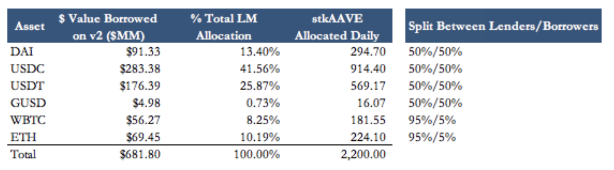
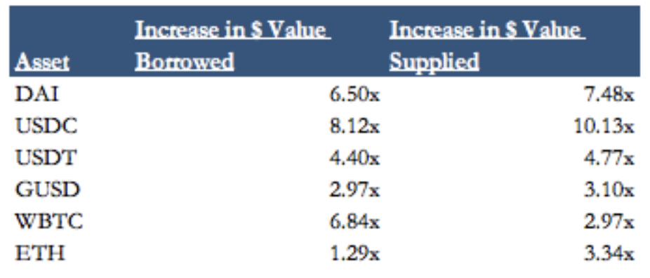
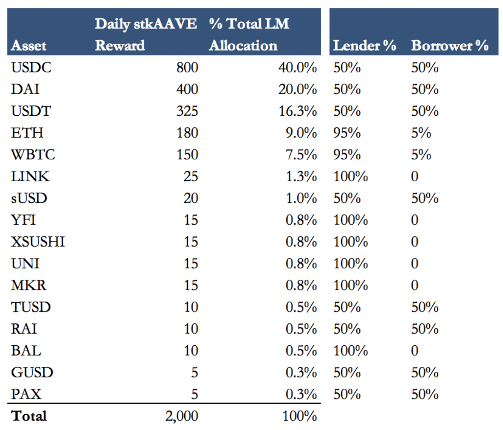

## **AAVE AIP 32**

**Liquidity Mining V1**

Liquidity mining incentives were introduced for Aave v2 on 4/26/21.

2,200 stkAAVE per day were allocated pro-rata across supported markets based on the dollar value of the borrowing activity in the underlying market. stkAAVE was distributed over AAVE to further align users with the Aave Protocol and increase the amount of AAVE staked in the safety module.

Liquidity Mining Recap (as of 7/15/21)

-   Value Distributed: During the liquidity mining campaign, 198,000 stkAAVE will be distributed to borrowers and lenders on Aave v2, using ~7% of the Ecosystem Reserve. This equates to $82MM in rewards (AAVE VWAP since LM program started).

-   TVL: v2 TVL rose from $7.8 billion to a high of $14.4 billion in mid-May. Stablecoin liquidity accounts for more than 60% of total Aave v2 liquidity.

-   V1 to V2 liquidity migration: v1 liquidity decreased from $2.5 billion to $372MM since the liquidity mining program started. 40% of Aave liquidity was deployed in v1 before the LM rewards started. Aave v1 liquidity now accounts for less than 3% of all liquidity on Aave. This allows the community to remain focused on v2 and upcoming money markets.

-   Growth in dollar value supplied and borrowed: The USDC and DAI markets experienced the largest increase in dollar value supplied and borrowed. Note - many users on these markets have recursively levered their position to maximize yields. Recursive leverage accounts for ~32% of all deposits on v2. This compares to ~40% on Aave’s Polygon market.

-   Reserve Growth: Since liquidity mining rewards launched, Aave’s v2 reserves have grown by [~$7MM](https://etherscan.io/address/0x464c71f6c2f760dda6093dcb91c24c39e5d6e18c).

Change in v2 markets from 4/26/21 to 7/15/21

**Liquidity Mining V2**

Aave's liquidity mining program is ending in the next few days.

We have seen several adjustments discussed in the forums including adding/removing new assets, allocating rewards based on health factors, additional vesting for stkAAVE rewards, and discouraging recursive borrowing. However, after discussing with several Aave community members and developers, these changes would require a heavy technical lift and potentially layer on a centralized distribution plan.

We are open to these changes in the future but to avoid a disruption to the liquidity mining program, we propose the following program for the next 3 months:

This proposal [passed on Snapshot](https://snapshot.org/#/aave.eth/proposal/QmeHAwW7XwUD3vqYLMRPF8MJiXkj2nnbRg1ae7mZ1SNQdm) with 91.7k AAVE voting in favor.

**Rationale**

Decrease in Daily stkAAVE Distributed

This program would decrease the liquidity mining distribution by 9%, saving $7.1MM for the Aave Ecosystem Reserve during the 3 month program.

New Assets

The goal of this program is to create a more inclusive liquidity mining program with the option to further refine the distribution once live.

Stablecoins remain the highest value asset for Aave v2. This program distributes 40% of the stkAAVE distribution to the USDC market given the USDC market size and utilization. The USDT distribution has been lowered and allocated to other stablecoin markets including DAI, RAI, PAX, TUSD, and sUSD. The DAI allocation has been increased to account for higher utilization and encourage more deposits.

We believe incentivizing several centralized and decentralized stablecoin markets will help build a more robust stablecoin ecosystem in Aave v2. As new stablecoins are onboarded to Aave, the Aave community can choose to include them in the distribution. The allocations across new markets will likely need fine tuning as we analyze borrow/lend activity.

WBTC and ETH allocations have been decreased and re-distributed to DeFi tokens listed on Aave.

Several tokens including LINK, YFI, xSUSHI, UNI, MKR, and BAL have also been included. The rewards for all of these markets are weighted 100% to lenders.

Similar to the first version of Aave’s liquidity mining program, we believe the distribution parameters will need to be further refined once borrow/lend activity is available.
