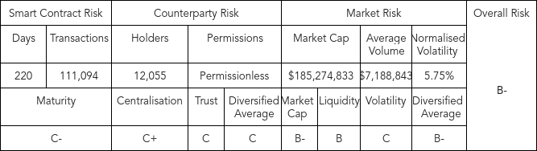

## Simple Summary

Add DPI as collateral support for DPI to the Aave market. 

## Abstract

Add DPI to Aave V2 market.

The DeFi Pulse Index (DPI) is a capitalization-weighted index that tracks the performance of decentralized financial assets across the market.

DPI is an ERC20 token that enables users to gain exposure to a basket of DeFi protocols via single transaction. The reduced volatility and broad diversification is a great property for collateral.

The index is weighted based on the value of each token’s circulating supply. DPI aims to track the projects in DeFi that have significant usage and show a commitment to ongoing maintenance and development. At the time of writing there are 14 tokens included in DPI. 

## Motivation

Aave would be the first major lending protocol to integrate an index product into its platform. DPI is becoming a DeFi standard and adding DPI would dramatically increase support for these efforts. 

There are over 12,000 DPI holders and growing. Adding DPI as collateral would bring users into the Aave ecosystem allowing capital, yield and value to accrue to Aave participants.

## Specification

DPI is a market capitalization weighted index product that follows a predetermined qualitative and quantitative methodology. The composition of the DPI portfolio is maintained by DeFi Pulse. 

The DPI token has no governance characteristics and is predominantly traded via the V2 Uniswap DPI-ETH pool. DPI is supported and maintained by Index Coop and is built on TokenSets infrastructure. 

At the time of writing, DPI has a market capitalization of greater than $220M and is the most readily traded DeFi index product.

There is an annual 95 basis point fee for holders of DPI that is split 70/30 between Index Coop and DeFi Pulse respectively. 

DPI-ETH earns INDEX rewards through liquidity mining, currently yielding upwards of 20% APR, in addition to around 5% in trading fee income with limited impermanent loss.

## Rationale

By purchasing DPI, users are able to gain exposure to leading DeFi protocols in the form of a single ERC20 token. The risk of holding just a select few protocols within a portfolio is diversified away, giving holders broad theme based exposure to DeFi.  

With Aave currently making up 20.88% of DPI, there is no better way for Aave to support DPI’s widespread adoption, than to enable DPI being utilized for borrowing and lending. With DPI trading since October 2020 and 90 day average trading volume of around $7.2M.

Additional information see Index Coop’s website: https://www.indexcoop.com/dpi

## Test Cases

Being a standard ERC20, the Aave protocol test cases already cover everything needed to support DPI. 

## Implementation

[PR to list DPI on Aave](https://github.com/aave/protocol-v2/pull/114)

# DPI - Aave Risk Assessment

The DeFi Pulse Index (DPI) is an index product managed by Index Coop. At the time of writing there are 324,355 DPI in circulation. DPI was audited by OpenZeppelin in September of 2020, launched early October 2020, and has over 111,000 user transactions. 
## DPI Smart Contract Risk: C-
DPI was audited by OpenZeppelin in September of 2020, launched early October 2020, and has over 111,000 user transactions. 
## DPI Counterparty Risk: C
DPI is a product whereby holders of DPI have no metagovernance influence on Index Coop or the protocol within the index. DPI trades on the ethereum network and inherits the trust of the network much like USDC. DPI has over 12,055 holders and the DPI-ETH pool is Uniswap’s 17th largest at $90M. Anyone can Mint, Trade and Redeem DPI. 
The DPI utilises TokenSets V2 smart contract has been audited by Open Zeppelin audit [September 4th, 2020] which identified privilege roles in many of the contracts. The key findings are highlighted below:
The Controller contract has an owner that chooses the contracts that comprise the system. This includes all of the modules, resources and the factories that can be used to make Sets. 
The IntegrationRegistry tracks third party integrations that can be used in the system. It also has an owner that can add, remove and edit the integrations as desired. 
The PriceOracle has a list of oracles and adapters that can be used to retrieve third party prices. It also has an owner role that can choose the supported oracles, adapters and price pairs. 
## DPI Market Risk: B-
DPI’s price tracks the Net Asset Value of the underlying assets, by holding a basket of protocol tokens the volatility of a single asset is dampened. This is reflected by DPI having a standard deviation of 5.75% since exception compared to ETH and AAVE which has a standard deviation of 5.03% and 7.79% respectively over the same time period (03/10/2021 to 01/05/2021). When considering liquidity, the average daily trading volume is $7.19M, based on over a trailing 90 day trading period. However, DPI holders have the option to mint/redeem the underlying tokens within DPI which draws on the liquidity of the underlying assets and also allows for any deviation from NAV to be arbitraged away by traders.  
| Statistics |                        |
|-----------------------------|-------|
|30 Day Average Daily Volume  |$7.19M |
|90 Day Average Daily Volume  |$7.19M |
|1 week Normalised Volatility |0.05379|
|1 month Normalised Volatility|0.05535|
|3 month Normalised Volatility|0.05035|
|6 month Normalised Volatility|0.05812|
|1 year Normalised Volatility |0.05845|

|Risk Parameters      |   |
|---------------------|---|
|LTV                  |60%|
|Liquidation Threshold|70%|
|Liquidation Bonus    |10%|
|Reserve Factor       |20%|

| Rate Strategy |    |
|---------------|----|
|UOptimal       |50% |
|R_0            |0%  |
|R_s1           |7%  |
|R_s2           |300%|

## Copyright

Copyright and related rights waived via [CC0](https://creativecommons.org/publicdomain/zero/1.0/).
