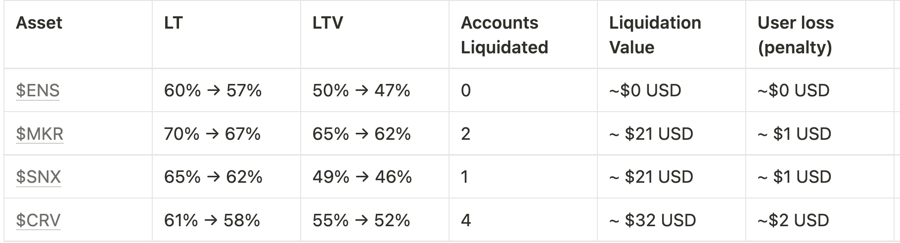

# Simple Summary

A proposal to adjust eight (8) total risk parameters, including Liquidation Threshold (LT) and Loan-To-Value (LTV), for four (4) assets on Aave V2 Ethereum.

# Abstract

Following recent market events, the AAVE community has decided to reduce the risk profile across many higher volatile assets by disabling borrow or freezing across v2 markets ([AIP-121](https://app.aave.com/governance/proposal/121/), [AIP-124](https://app.aave.com/governance/proposal/124/), and [AIP-125](https://app.aave.com/governance/proposal/125/))

After mitigating the immediate risk to the protocol with the above AIPs, Chaos Labs is exploring the impact and trade-offs of decreasing the Liquidation Thresholds and LTVs of long-tail assets on Ethereum v2 (ENS, MKR, SNX, and CRV).

# Motivation

Capital efficiency reductions on v2 assets will further mitigate attack vectors, in part by increasing the capital required to wage a price manipulation attack on Aave. In addition, these changes will act as an effective motivation to shift usage to v3, where users can enjoy the benefits of E-mode with enhanced risk techniques and mitigation methodologies.

As Liquidation Threshold reductions may lead to user accounts being eligible for liquidations upon their approval, we want to clarify the full implications to the community at each step. To best minimize this impact, we suggest reaching the desired settings by a series of incremental decreases, following the Risk-Off Framework previously approved by the community, with a reduction of up to 3% in any given AIP. In an attempt to avoid liquidations, Chaos Labs will communicate the planned amendments 7 days before their on-chain execution via all available avenues (Twitter, forums, Nansen Connect, and Blockscan Chat).

The respective data can be found in the governance forum discussion linked below:
- [[ARC] - Risk Parameter Updates for Aave v2 Ethereum - LTs and LTVs for Long Tail Assets (2022.12.04)](https://governance.aave.com/t/arc-risk-parameter-updates-for-aave-v2-ethereum-lts-and-ltvs-for-long-tail-assets-2022-12-04/10926)

# Specification

The following risk parameter proposal is presented below:

*Data from Mainnet snapshot captured on December 15th, 2022, 14:30 GMT

# Implementation
Payload implemendations can be found [here](https://github.com/ChaosLabsInc/aave-v2-payloads/blob/main/src/payloads/LTTailDecemberPayload.sol)

Proposal payload - [0x33d7385B2BF82b2183aFc66dC84EA5f3F2D240D5](https://etherscan.io/address/0x33d7385b2bf82b2183afc66dc84ea5f3f2d240d5#code)

# Copyright

Copyright and related rights waived via [CC0](https://creativecommons.org/publicdomain/zero/1.0/).
