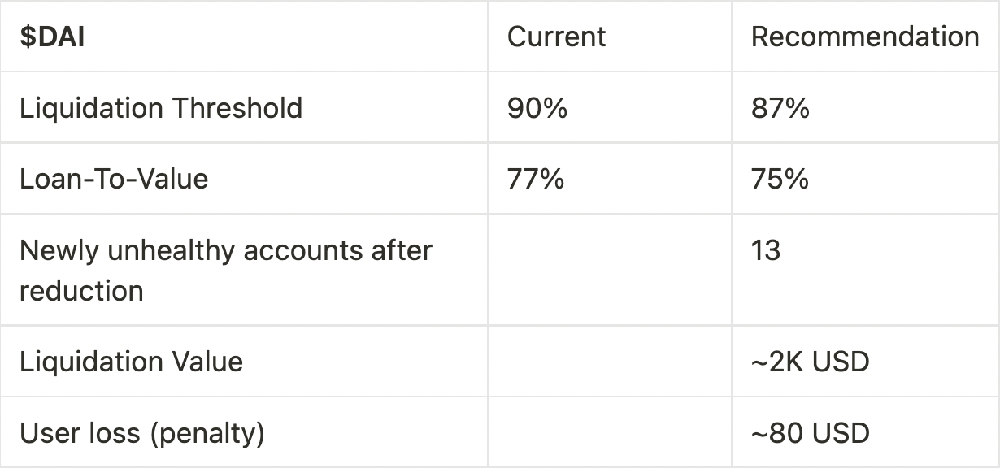
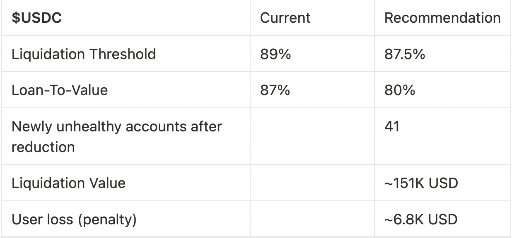

# Simple Summary

A proposal to adjust 4 total risk parameters, including Liquidation Threshold (LT) and Loan-To-Value (LTV), for USDC and DAI markets on Aave V2 Ethereum.

# Abstract

Following recent market events, the AAVE community has decided to reduce the risk profile across many higher volatile assets by disabling borrow or freezing across v2 markets ([AIP-121](https://app.aave.com/governance/proposal/121/), [AIP-124](https://app.aave.com/governance/proposal/124/), and [AIP-125](https://app.aave.com/governance/proposal/125/))

After mitigating the immediate risk to the protocol with the above AIPs, Chaos Labs is exploring the impact and trade-offs of decreasing the Liquidation Thresholds and LTVs of USDC and DAI. Reducing capital efficiency on v2 assets will mitigate attack vectors while also serving as effective motivation to shift usage to v3, where users can enjoy the benefits of E-mode with enhanced risk techniques and mitigation methodologies.

As Liquidation Threshold reductions may lead to user accounts being eligible for liquidations upon their approval, we want to make the full implications clear to the community at each step. To best minimize this impact, we suggest reaching the desired settings by a series of incremental decreases, following the [Risk-Off Framework](https://snapshot.org/#/aave.eth/proposal/bafkreigdmcfmwvnxfolpds4xkdicgrszgmknig7pz2r2t37tltupdpyfu4) previously approved by the community, with a reduction of up to 3% in any given AIP. In an attempt to avoid liquidations, Chaos Labs will communicate the planned amendments 7 days before their on-chain execution via all available avenues (Twitter, forums, Nansen Connect, and Blockscan Chat).

# Motivation

The priority of this proposal is not to optimize markets (capital efficiency); but rather to focus on the security and risk mitigation of the protocol. It will be followed up with additional proposals to update risk parameters to reflect the current market conditions accurately.

The goal of this ARC is two-fold:

- Reduce LTs → Reducing liquidation thresholds for USDC and DAI effectively reduces capital efficiency and increases the required capital for waging price manipulation attacks on Aave.
- Encourage user migrations to v3 → This also begins to pave the way towards migrating to v3, where these assets can be utilized in E-mode.

However, this is a significant change, and we wanted to present data to quantify and visualize the effect of such reductions on protocol users for community discussion. Specifically, we want to surface data around the liquidations this would trigger, as some are sizable and warrant a discussion of how these should be handled and if this is the most appropriate action forward.

The respective data can be found in the governance forum discussion linked below:
- [[ARC] - Risk Parameter Updates for Aave v2 Ethereum - LT and LTV (2022.12.01)](https://governance.aave.com/t/arc-risk-parameter-updates-for-aave-v2-ethereum-lt-and-ltv-2022-12-01/10897)

# Specification

The following risk parameter proposal is presented below:

*Data from Mainnet snapshot captured on December 15th, 2022, 14:30 GMT

# Implementation
Payload implemendations can be found below:
- USDC - [LINK](https://github.com/ChaosLabsInc/aave-v2-payloads/blob/main/src/payloads/DaiLTDecemberPayload.sol)
- DAI - [LINK](https://github.com/ChaosLabsInc/aave-v2-payloads/blob/main/src/payloads/UsdcLTDecemberPayload.sol)

Proposal payloads can be found below: 
- USDC - [0xeca5bdf0C2b352cBE2D9A19b555E1EC269d4765C](https://etherscan.io/address/0xeca5bdf0c2b352cbe2d9a19b555e1ec269d4765c#code)
- DAI - [0x60bCd1CaF97c3fCbC35Bf92A8852728420C34FB5](https://etherscan.io/address/0x60bcd1caf97c3fcbc35bf92a8852728420c34fb5#code)

# Copyright

Copyright and related rights waived via [CC0](https://creativecommons.org/publicdomain/zero/1.0/).
