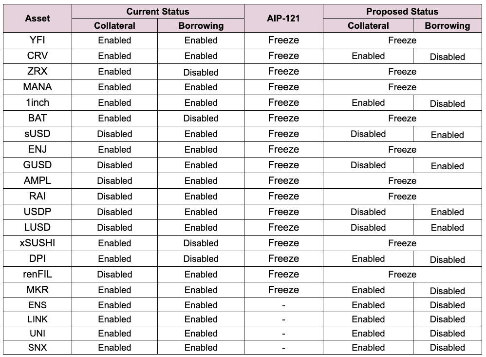

# Simple Summary

In response to recent market events and resulting discussion on the governance forum, Llama and Chaos Labs propose to make a series of parameter changes to the Ethereum Aave v2 Liquidity Pool.

# Abstract

This proposal presents an alternative pathway forward to [AIP-121](https://app.aave.com/governance/proposal/?proposalId=121). The community can elect to Disable Borrowing whilst retaining the ability to Deposits assets across the majority of Reserves rather than Freezing as outlined in AIP-121.

This proposal is a collaborative effort between Llama and Chaos Labs and reflects the communities [governance forum discussion](https://governance.aave.com/t/arc-risk-parameter-recommendations-for-aave-v2-eth-2022-11-22/10757/35). 

# Motivation

In response to recent market events and the continued contraction of liquidity across markets, this proposal seeks to reduce the risk profile across many higher volatile assets. AIP-121 presents an opportunity to Freeze many Reserves, whereas this proposal intends to Disable Borrowing whilst retaining the ability to deposit assets. 

AIP-121 is a more conservative response relative to this proposal. It is likely, LTV and LT thresholds for highly liqudity assets will also require amending in the near future. This will be managed via a separate submission. 

# Specification

The following risk parameter proposal are presented below:

# Implementation

This proposal will reconfigure the following asset Reserves:

* YFI
* CRV
* ZRX
* MANA
* 1INCH
* BAT
* sUSD
* ENJ
* GUSD
* AMPL
* RAI
* USDP
* LUSD
* xSUSHI
* DPI
* renFIL
* MKR
* ENS
* LINK
* UNI 
* SNX

This proposal is written in an atomic manner that will unfreeze reserves in case [AIP-121](https://app.aave.com/governance/proposal/?proposalId=121) gets executed before.

To achieve this, `freezeReserve(address asset)`, `unfreezeReserve(address asset)` and `disableBorrowingOnReserve(address asset)` will be performed via the PoolConfigurator for each asset respectively to ensure a predictable final state.

`POOL_CONFIGURATOR.freezeReserve(address asset)`
`POOL_CONFIGURATOR.unfreezeReserve(address asset)`
`POOL_CONFIGURATOR.disableBorrowingOnReserve(address asset)`

Implementation can be found [here](https://github.com/defijesus/risk-params-update-aave-eth-v2)

# Copyright

Copyright and related rights waived via [CC0](https://creativecommons.org/publicdomain/zero/1.0/).
