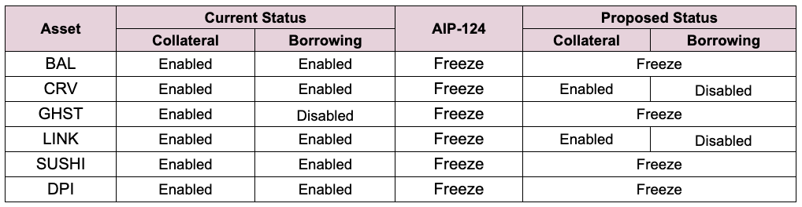

# Simple Summary

In response to recent market events and the resulting discussion on the [Aave governance forum](https://governance.aave.com/t/arc-risk-parameter-recommendations-for-aave-v2-eth-2022-11-22/10757) regarding the Aave communities risk appetite, Llama and Chaos Labs proposes to make a series of parameter changes to the Polygon Aave v2 Liquidity Pool.

# Abstract

We specifically recommend freezing for GHST, BAL and SUSHI as a risk-off approach as the community can utilise the asset on the Polygon v3 deployment with enhanced risk tooling, such as supply and borrow caps. Borrowing is to be disabled for LINK, DPI and CRV Reserves.

# Motivation

In response to recent market events and the continued contraction of liquidity across markets, this proposal seeks to reduce the risk profile across many higher volatile assets.

It is likely, LTV and Liquidation Threshold (LT) for highly liquid assets will also require amending in the near future. This will be managed via a separate submission.

# Specification

The following risk parameter proposal is presented below:

# Implementation

This proposal will reconfigure the following asset Reserves:

* BAL
* CRV
* GHST
* LINK
* SUSHI
* DPI

This proposal is written in an atomic manner that will unfreeze reserves in case [AIP-124](https://app.aave.com/governance/proposal/?proposalId=124) gets executed before.

To achieve this, `freezeReserve(address asset)`, `unfreezeReserve(address asset)` and `disableBorrowingOnReserve(address asset)` will be performed via the PoolConfigurator for each asset respectively to ensure a predictable final state.

`POOL_CONFIGURATOR.freezeReserve(address asset)`
`POOL_CONFIGURATOR.unfreezeReserve(address asset)`
`POOL_CONFIGURATOR.disableBorrowingOnReserve(address asset)`

Implementation can be found [here](https://github.com/defijesus/risk-params-update-v2-polygon)

# Copyright

Copyright and related rights waived via [CC0](https://creativecommons.org/publicdomain/zero/1.0/).
