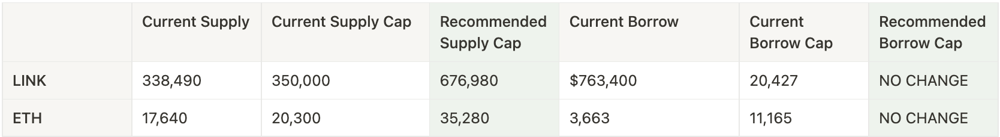
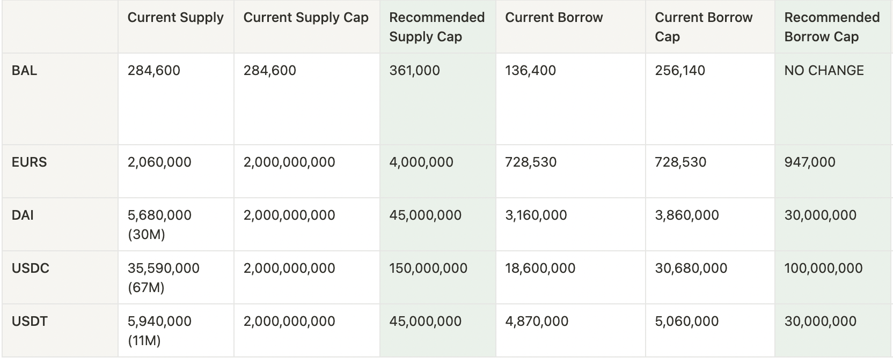

# Simple Summary

A proposal to adjust five (11) total risk parameters, including Supply Cap and Borrow Cap, across seven (7) Aave V3 Polygon and Arbitrum assets.

# Motivation

The objective of this proposal is to recommend updated supply and borrow caps for V3 assets that have reached high utilization of either cap. The recommendations provided in this proposal were derived using Chaos Labs’ Updated Supply and Borrow Cap Methodology

The respective governance forum discussion is linked below:
- [Chaos Labs Supply and Borrow Cap Updates - Aave V3 Polygon and Arbitrum - 2023.02.07](https://governance.aave.com/t/arc-chaos-labs-supply-and-borrow-cap-updates-aave-v3-polygon-and-arbitrum-2023-02-07/11605)

# Specification

The following risk parameter proposal is presented below:

- Arbitrum

- Polygon

# References
[Forum Post](https://governance.aave.com/t/arc-chaos-labs-supply-and-borrow-cap-updates-aave-v3-polygon-and-arbitrum-2023-02-07/11605)

Tests: [Arbitrum](https://github.com/bgd-labs/aave-v3-crosschain-listing-template/blob/master/src/test/arbitrum/AaveV3ArbBorrowCapsPayload-Feb12.t.sol), [Polygon](https://github.com/bgd-labs/aave-v3-crosschain-listing-template/blob/master/src/test/polygon/AaveV3PolCapsPayload-Feb12.t.sol)

Proposal payload implementation - [Arbitrum](https://github.com/bgd-labs/aave-v3-crosschain-listing-template/blob/master/src/contracts/arbitrum/AaveV3ArbCapsPayload-Feb12.sol), [Polygon](https://github.com/bgd-labs/aave-v3-crosschain-listing-template/blob/master/src/contracts/polygon/AaveV3PolCapsPayload-Feb12.sol)

Deployed proposal payload - [Arbitrum](https://arbiscan.io/address/0x280e404338d9d8e50b11d6677b9c91ba86e0fd22#code), [Polygon](https://polygonscan.com/address/0x060bea15af594fe9e0a243ca632f2c7d1935c70f#code)

# Copyright

Copyright and related rights waived via [CC0](https://creativecommons.org/publicdomain/zero/1.0/).
