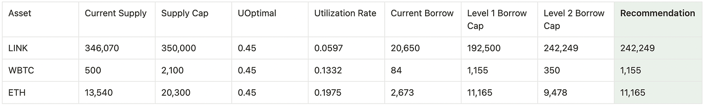
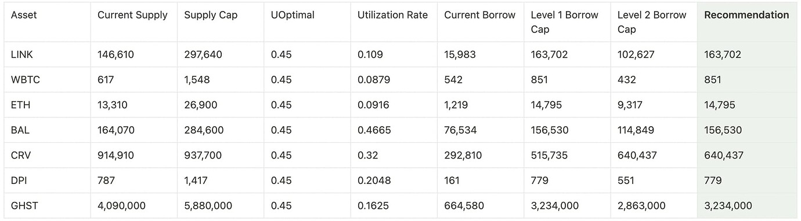
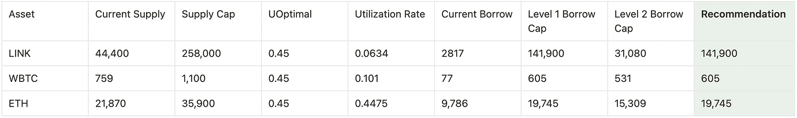
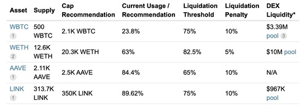
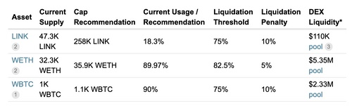

# Simple Summary

A proposal to:
- Add Borrow Caps for six (6) uncapped assets and amend the Borrow Cap of seven (7) assets across three (3) chains in v3.
- Add Supply Caps for seven (7) uncapped assets on (2) chains in v3.

# Motivation

The objective of this proposal by Chaos Labs is to recommend:
- Supply caps for for v3 uncapped assets, taking into account Asset Market Cap, Asset Counter Party Risk, Asset Volume, Asset Liquidity (DEX and CEX based), Historical Liquidations in times of high volatility
- Borrow caps using the AAVE V3 [Borrow Caps Methodology](https://governance.aave.com/t/aave-v3-borrow-caps-methodology/10925).

These are initial supply and borrow caps for these assets and they will be continuosly iterated upon.

The respective governance forum discussion is linked below:
- [[ARC] V3 Borrow Cap Recommendations (Fast-track)](https://governance.aave.com/t/arc-v3-borrow-cap-recommendations-fast-track-2022-12-05/10927)
- [V3 Supply Cap Recommendations for Uncapped Assets (Fast-track)](https://governance.aave.com/t/arc-v3-supply-cap-recommendations-for-uncapped-assets-fast-track/10750)

# Specification

The following risk parameter proposal is presented below:

Borrow Caps:
- Arbitrum

- Polygon

- Optimism

Supply Caps:
- Arbitrum

- Optimism

# Implementation
Payload implemendations can be found below:
- Borrow Caps ([Polygon](https://github.com/bgd-labs/aave-v3-crosschain-listing-template/blob/master/src/contracts/polygon/AaveV3PolBorrowCapsPayload.sol), [Arbitrum](https://github.com/bgd-labs/aave-v3-crosschain-listing-template/blob/master/src/contracts/arbitrum/AaveV3ArbBorrowCapsPayload.sol), [Optimism](https://github.com/bgd-labs/aave-v3-crosschain-listing-template/blob/master/src/contracts/optimism/AaveV3OptBorrowCapsPayload.sol))
- Supply Caps ([Arbitrum](https://github.com/bgd-labs/aave-v3-crosschain-listing-template/blob/master/src/contracts/arbitrum/AaveV3ArbCapsPayload.sol), [Optimism](https://github.com/bgd-labs/aave-v3-crosschain-listing-template/blob/master/src/contracts/optimism/AaveV3OptCapsPayload.sol))

Proposal payloads can be found below: 
- Borrow Caps ([Polygon](https://polygonscan.com/address/0x691b41805f7ef2d7de6165bc42295b035a31600d#code), [Arbitrum](https://arbiscan.io/address/0x691b41805f7ef2d7de6165bc42295b035a31600d#code), [Optimism](https://optimistic.etherscan.io/address/0x280e404338d9d8e50b11d6677b9c91ba86e0fd22#code))
- Supply Caps ([Arbitrum](https://arbiscan.io/address/0xc9df68edcb0c8fb7ced82e5836b75c002c723e17#code), [Optimism](https://optimistic.etherscan.io/address/0x691b41805f7ef2d7de6165bc42295b035a31600d#code))

# Copyright

Copyright and related rights waived via [CC0](https://creativecommons.org/publicdomain/zero/1.0/).
